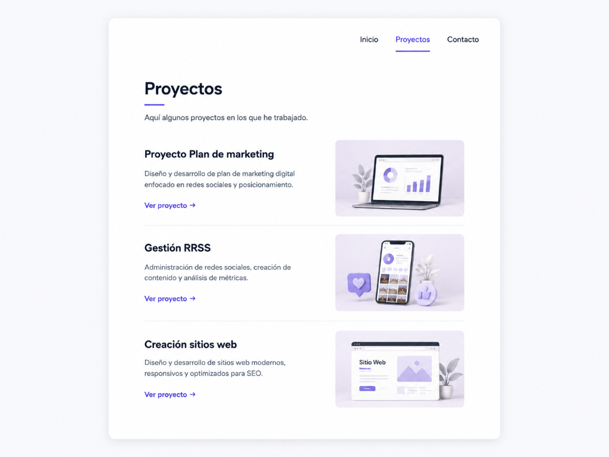
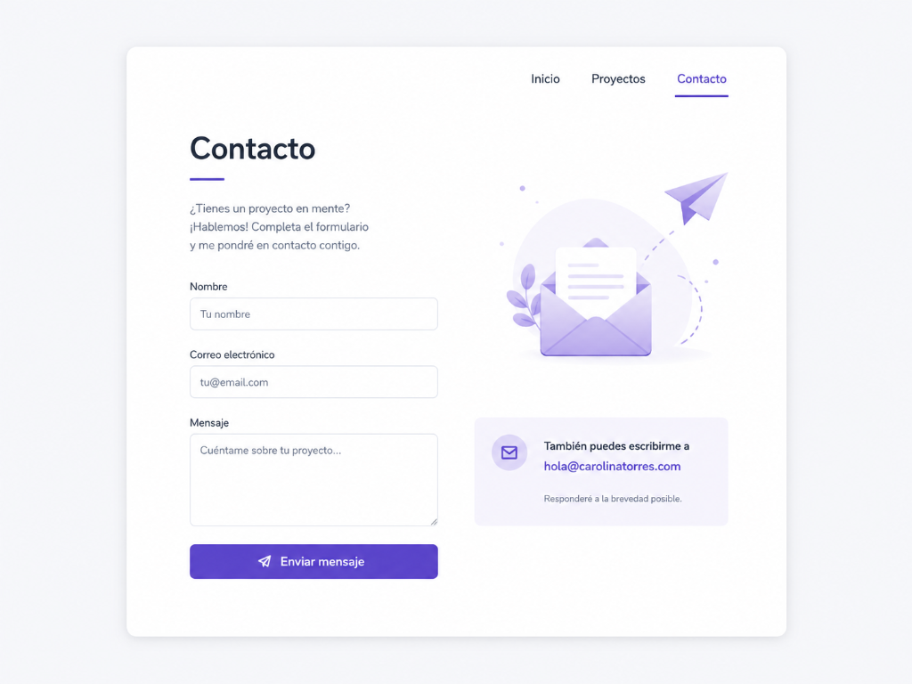

# Guía de Aprendizaje: Formativa 02 — Mi Sitio Personal Navegable

¡Hola! En esta segunda fase de tu portafolio, darás el salto de una página simple a un **sitio web completo y navegable de 3 páginas**. El objetivo es conectar tu tarjeta de presentación inicial con una sección donde muestres tu trabajo y otra con un formulario para que puedan contactarte.

Las tres páginas que compondrán tu sitio son:
1. `index.html` (Tu tarjeta de presentación de la Formativa 01).
2. `proyectos.html` (Tus proyectos destacados).
3. `contacto.html` (Formulario de contacto).

---

## 📸 Diseños de Referencia

Tu sitio debe estructurarse de manera similar a las siguientes imágenes. Recuerda que la propuesta estética es completamente libre y debes personalizarla con tu paleta de colores y tipografías:

### Página de Proyectos (`proyectos.html`)


### Página de Contacto (`contacto.html`)


---

## 📁 1. Estructura del Proyecto
Tu directorio de trabajo debe estar organizado de la siguiente manera:

```text
mi-portafolio/
│
├── index.html                  <-- Tarjeta de presentación (Inicio)
├── proyectos.html              <-- Página de proyectos (Nueva)
├── contacto.html               <-- Página de contacto (Nueva)
│
├── css/
│   └── style.css               <-- Tus estilos CSS (compartidos para las 3 páginas)
│
└── img/
    ├── avatar.jpg              <-- Tu foto de perfil de la Formativa 01
    ├── proyecto1.jpg           <-- Capturas o imágenes de tus proyectos
    ├── proyecto2.jpg
    └── proyecto3.jpg
```

> [!IMPORTANT]
> **Consistencia Visual:** Para que tu portafolio se vea profesional, las 3 páginas deben estar vinculadas al mismo archivo CSS (`css/style.css`). Esto asegura que compartan el mismo fondo, colores, fuentes tipográficas y diseño de contenedor central.

---

## 🔗 2. Navegación Común
Para que el usuario pueda viajar libremente por tu sitio, debes incluir el mismo menú de navegación en la parte superior del contenedor central en las tres páginas:

```html
<!-- Menú de Navegación común -->
<nav class="nav-menu">
    <a href="index.html">Inicio</a>
    <a href="proyectos.html">Proyectos</a>
    <a href="contacto.html">Contacto</a>
</nav>
```

### 🚨 Reglas críticas para los enlaces:
* **Usa rutas relativas:** Los enlaces deben apuntar directamente a los nombres de los archivos (`index.html`, etc.). **Nunca** uses rutas de tu computadora (como `file:///C:/Users/...` o `/Users/carolina/...`), ya que no funcionarán al publicarse en internet.
* **Sin enlaces rotos:** Asegúrate de probar que todos los menús funcionen de ida y vuelta en cada una de las 3 páginas.

---

## 💻 3. Página de Proyectos (`proyectos.html`)
Debes presentar **3 proyectos destacados** (pueden ser reales, académicos o ficticios). Cada proyecto debe estar bien organizado y contener:
* Nombre del proyecto.
* Breve descripción de qué es y qué tecnologías usaste.
* Una imagen ilustrativa.
* Un enlace funcional (por ejemplo, a GitHub, un pdf de google drive, etc).

### 🏗️ Estructura HTML sugerida para la sección de proyectos:
```html
<div class="projects-container">
    <h2>Mis Proyectos</h2>
    
    <div class="projects-grid">
        <!-- Proyecto 1 -->
        <article class="project-card">
            
            <h3>Proyecto 1: Dashboard Financiero</h3>
            <p>Una aplicación web para gestionar finanzas personales utilizando HTML semántico y CSS responsivo.</p>
            <a href="https://github.com/tu-usuario/proyecto-1" target="_blank" class="btn-link">Ver Código</a>
        </article>
        
        <!-- Repite la estructura para el Proyecto 2 y Proyecto 3 -->
    </div>
</div>
```

---

## ✉️ 4. Página de Contacto (`contacto.html`)
Debes construir un formulario limpio y accesible para que las visitas puedan escribirte. El formulario debe incluir como mínimo:
* **Nombre** (campo de texto).
* **Correo electrónico** (campo tipo email).
* **Mensaje** (área de texto multilinea).
* **Botón enviar**.

### 🚨 Requisitos de Accesibilidad y Semántica:
* Usar la etiqueta `<form>` para envolver el formulario.
* Cada campo de entrada (`<input>` o `<textarea>`) debe estar asociado a una etiqueta `<label>` usando el atributo `for` coincidente con el `id` del input.
* Aplicar el atributo `required` a los campos obligatorios para evitar envíos vacíos.
* Usar los tipos correctos como `type="email"` para validar de forma automática el correo.

### 🏗️ Estructura HTML sugerida para el formulario:
```html
<div class="contact-container">
    <h2>Contacto</h2>
    <p>¡Escríbeme un mensaje y nos pondremos en contacto a la brevedad!</p>
    
    <form action="#" method="POST" class="contact-form">
        <div class="form-group">
            <label for="username">Nombre Completo:</label>
            <input type="text" id="username" name="username" placeholder="Ej. Juan Pérez" required>
        </div>
        
        <div class="form-group">
            <label for="email">Correo Electrónico:</label>
            <input type="email" id="email" name="email" placeholder="ejemplo@correo.com" required>
        </div>
        
        <div class="form-group">
            <label for="message">Mensaje:</label>
            <textarea id="message" name="message" rows="5" placeholder="Escribe tu mensaje aquí..." required></textarea>
        </div>
        
        <button type="submit" class="btn-submit">Enviar Mensaje</button>
    </form>
</div>
```
*(Nota: El formulario no necesita enviar datos reales a un servidor por ahora).*

---

## 🎨 5. Tips de Diseño y Estilo
Para alinear los proyectos y los elementos del formulario en tu CSS, te recomendamos:
* **Grid o Flexbox:** Usa `display: flex; flex-direction: column; gap: 15px;` en el formulario para apilar los campos ordenadamente.
* **Estilos del botón:** Dale estilos atractivos a tus botones y enlaces de acción con bordes redondeados y un efecto hover (ej. `transition: background 0.3s;`).
* **Regla de Color:** Sigue aplicando la regla **60-30-10** (tu fondo claro u oscuro, textos legibles en azul/gris oscuro y el botón de enviar en tu color de acento brillante).

---

## 🛠️ Rúbrica de Evaluación (30 Puntos)

| Criterio | Logro completo | Logro parcial | Logro insuficiente | Máx |
| :--- | :--- | :--- | :--- | :---: |
| **Navegación** | 3 páginas conectadas perfectamente mediante menú común. | Errores de consistencia o enlaces rotos. | Sin navegación funcional. | **4 pts** |
| **Proyectos** | 3 proyectos estructurados con texto e imagen según guías. | Faltan elementos, descripciones o imágenes rotas. | Página ausente o muy incompleta. | **5 pts** |
| **Contacto** | Formulario completo con atributos avanzados (`required`, tipos correctos). | Faltan campos clave, etiquetas o atributos de validación. | Formulario no estructurado. | **5 pts** |
| **Consistencia** | Estilos, colores y tipografías coherentes en las 3 páginas. | Inconsistencias visuales marcadas entre páginas. | Diseños totalmente no relacionados. | **4 pts** |
| **Git & GitHub** | Mínimo 3 nuevos commits descriptivos del avance. | Commits insuficientes o sin descripciones claras. | Sin commits correspondientes a esta fase. | **4 pts** |
| **Publicación** | Todo funcional y actualizado en GitHub Pages. | Errores menores de carga en assets (imágenes, CSS). | No publicado en la web. | **3 pts** |
| **Autoaprendizaje** | Investiga y aplica autónomamente soluciones para maquetación o validación basándose en las guías y tutoriales. | Aplica soluciones pero no documenta qué guías o recursos utilizó. | No demuestra resolución autónoma de problemas técnicos. | **5 pts** |

---

## 🚀 Pasos para realizar la entrega:
1. Diseña y programa `proyectos.html` y `contacto.html`.
2. Vincula el menú de navegación en las tres páginas.
3. Asegura que los estilos en `style.css` mantengan la consistencia.
4. Haz commits descriptivos de tu avance (ej. `git commit -m "feat: agregar pagina de proyectos con grid"`) - recuerda que se evaluará el **último commit antes de la fecha límite**.
5. Sube tu código a GitHub (`git push origin main`) y verifica que se publique correctamente en tu enlace de **GitHub Pages** (se evaluará el **último deployment** realizado).
6. **Activa la opción "Deployments"** en el panel de detalles de tu repositorio de GitHub (dentro de la sección *About* -> clic en el engranaje ⚙️ -> marca la opción *Deployments* bajo *Include in the home page* -> *Save changes*). ¡Este paso es obligatorio para poder revisar tu historial de publicaciones!
