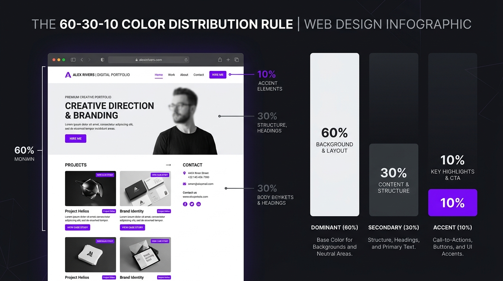
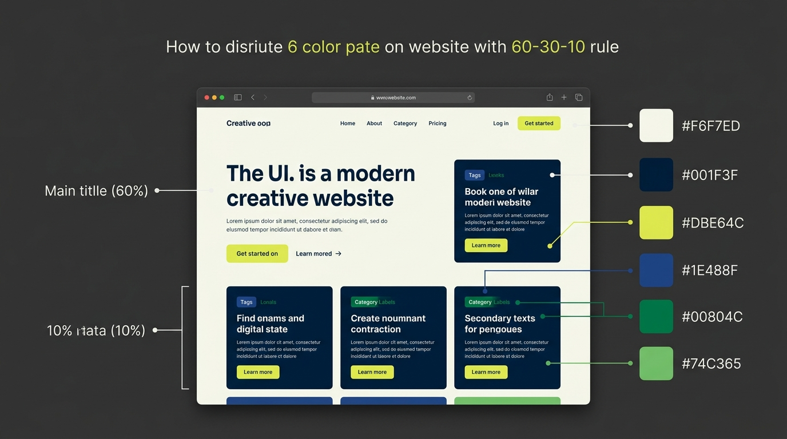
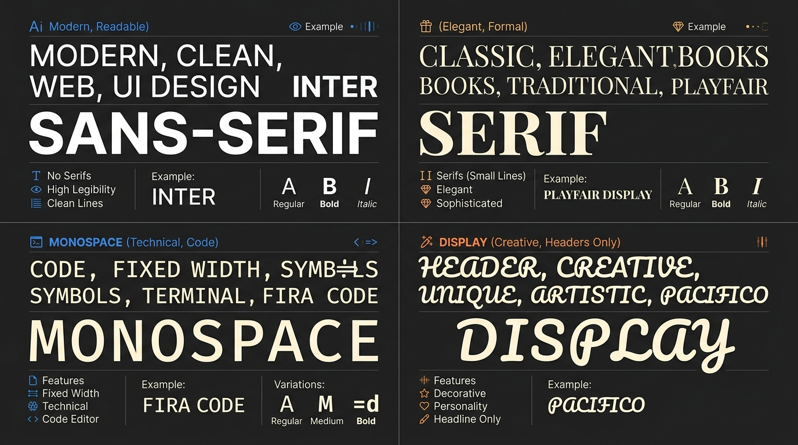
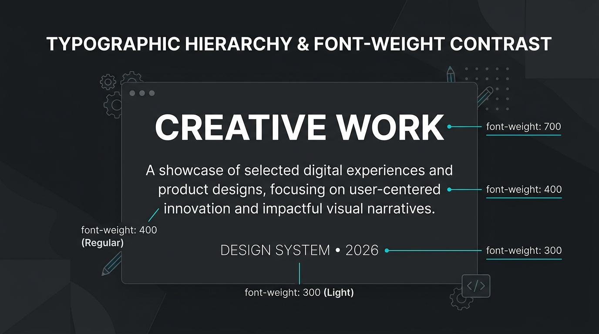

# Guía de Diseño: Colores, Tipografías y Contraste para tu Web

¡Hola! Diseñar tu primer sitio web puede parecer un reto, pero con algunos conceptos clave de diseño visual podrás crear un portafolio web con una estética premium, ordenado y muy legible. 

Esta guía te ayudará a tomar decisiones sobre los **colores**, la **tipografía** y el **contraste** de tu proyecto.

---

## 🎨 1. Elección de la Paleta de Colores

Para que tu sitio web sea consistente, debes elegir una paleta de colores antes de empezar a programar. Una buena paleta suele tener entre **3 y 5 colores**.

### 🔍 ¿Dónde buscar inspiración?
*   **Pinterest:** Es una fuente de inspiración increíble. Ve al buscador de Pinterest y busca términos como:
    *   *«Color palettes web»* (Paletas de colores para web)
    *   *«Minimalist color palette»* (Paletas minimalistas)
    *   *«UI UX color palette»*
    Guarda las imágenes de las paletas que más te gusten y te inspiren.
*   **[Coolors (coolors.co)](https://coolors.co/):** Es el generador de paletas de colores más popular y fácil de usar.
    *   Presiona la **barra espaciadora** para generar paletas aleatorias y armoniosas al instante.
    *   Si te gusta un color, puedes bloquearlo con el icono del **candado** y seguir presionando la barra espaciadora para buscar colores que combinen con él.
    *   Copia los códigos hexadecimales (por ejemplo, `#4A3AFF` o `#F0F4F8`) para usarlos en tu archivo CSS.

---

## 🌓 2. Distribución de Colores y Guía de Contraste

No basta con elegir colores bonitos, también hay que saber qué rol cumple cada uno. En el diseño web, solemos estructurar los colores en cuatro roles principales:

| Rol de Color | Porcentaje Sugerido | Propósito | Ejemplo de Uso |
| :--- | :---: | :--- | :--- |
| **Color de Fondo** | **60%** (Predominante) | Da descanso visual. Suele ser neutro y suave. | Fondo del `body` o fondo de la tarjeta. |
| **Color Primario** | **30%** (Estructural) | Define el tono general del sitio y los textos principales. | Títulos (`h1`), textos del menú, subtítulos. |
| **Color Secundario** | **10% - 15%** | Se usa para dar jerarquía a textos o elementos de menor relevancia. | Párrafos secundarios, pies de página, bordes sutiles. |
| **Color de Acento** | **5% - 10%** (Llamativo) | Atrae la atención del usuario a elementos interactivos clave. | Botones de redes sociales, enlaces activos, hovers. |

### 💡 Ejemplo de Aplicación Simple
Aquí tienes un ejemplo de cómo se aplica esta regla con una paleta de solo 3 colores (Fondo blanco, Texto negro y Botones azules):
*   **60% (Blanco):** El fondo de toda la página y el fondo de la tarjeta de presentación.
*   **30% (Negro):** Todos los títulos (`h1`, `h2`) y todo el texto de los párrafos.
*   **10% (Azul):** Solo los botones de "Contactar" y los enlaces del menú.

### 💡 Ejemplo con una Paleta Variada
Cuando tienes una paleta más colorida o con múltiples tonos (como la mostrada abajo), la regla del **60-30-10** sigue aplicando para mantener el orden visual y evitar que tu web parezca un arcoíris desordenado:
*   **60% (Fondo):** Un color neutro y muy claro (como `Praxeti White #F6F7ED`) para dar descanso a la vista.
*   **30% (Estructural):** Un tono fuerte y oscuro (como `Midnight Mirage #001F3F`) para definir la estructura de la interfaz, textos principales o fondos de tarjetas.
*   **10% (Acento y Secundarios):** El color más vibrante se reserva estrictamente para botones de acción o llamados de atención (ej: `First Colors of Spring #DBE64C`), mientras que los colores secundarios y complementarios se aplican de forma muy controlada en etiquetas, iconos o pequeños textos informativos (ej: `Nuit Blanche #1E488F`, `Picture Book Green #00804C` y `Mantis #74C365`).

### 🚨 La Regla de Oro: El Contraste y la Legibilidad
El contraste es la diferencia de luminosidad entre el texto y el fondo sobre el cual está escrito. **Si el contraste es bajo, tu web será imposible de leer.**

*   **Texto oscuro sobre fondo claro:** Si usas un fondo blanco o gris claro, asegúrate de que el texto sea de un color muy oscuro (negro, gris carbón o azul marino oscuro).
*   **Texto claro sobre fondo oscuro:** Si diseñas un modo oscuro (fondo negro o azul marino), las letras deben ser blancas, gris muy claro o tonos pastel muy suaves.
*   **Cuidado con el acento:** Nunca escribas textos largos en tu color de acento si este es muy brillante (como amarillo, verde neón o naranja), ya que cansará la vista rápidamente. Usa el acento solo para detalles puntuales (ej. el fondo de un botón con letras blancas).

---

## ✍️ 3. Guía de Estilos Tipográficos

La tipografía transmite la personalidad de tu sitio. Google Fonts es la mejor biblioteca gratuita para elegir e importar fuentes en tu web.

### 🔗 Acceso a Fuentes Gratuitas: [Google Fonts](https://fonts.google.com/)

### 📂 Clasificación de Tipografías y sus Usos

Existen diferentes familias de fuentes. Cada una sirve para propósitos distintos dentro de una interfaz web:

#### 1. Sans-serif (Palo Seco)
*   **Características:** Limpias, modernas, sin pequeños remates ni adornos en las esquinas.
*   **Para qué sirve:** Son las más legibles en pantallas digitales. Ideales para párrafos, botones, menús de navegación y el cuerpo del texto en general.
*   **Ejemplos populares en Google Fonts:** *Inter, Roboto, Montserrat, Outfit, Poppins, Open Sans*.

#### 2. Serif (Con Serifas / Remates)
*   **Características:** Tienen pequeños adornos o terminaciones en los extremos de las letras. Transmiten elegancia, formalidad y tradición.
*   **Para qué sirve:** Excelente para titulares grandes, nombres principales o bloques editoriales. Evita usarlas en textos muy pequeños.
*   **Ejemplos populares en Google Fonts:** *Playfair Display, Lora, Merriweather, Georgia*.

#### 3. Monospace (Monoespaciadas)
*   **Características:** Cada letra ocupa exactamente el mismo ancho horizontal. Transmite una estética técnica, de programación, retro o industrial.
*   **Para qué sirve:** Ideal para mostrar código, etiquetas, tags informativos pequeños, o para darle un look técnico a tu portafolio.
*   **Ejemplos populares en Google Fonts:** *Fira Code, JetBrains Mono, Source Code Pro, Space Mono*.

#### 4. Display / Decorative (Fantasía o Decorativas)
*   **Características:** Tienen formas muy artísticas, informales o caligráficas. Poseen muchísima personalidad.
*   **Para qué sirve:** **Únicamente** para logotipos o títulos gigantescos de una o dos palabras. **Nunca** las uses para párrafos o menús de navegación porque destruyen la legibilidad.
*   **Ejemplos populares en Google Fonts:** *Pacifico, Bungee, Cinzel Decorative, Lobster*.

---

## 💡 Consejos de Oro Tipográficos

1.  **Limítate a 1 o 2 fuentes:** Usar más de dos fuentes diferentes hará que tu sitio se vea desordenado y tardará más en cargar. La mejor combinación es una fuente **Serif** o **Display** para títulos, y una **Sans-serif** para todo el cuerpo del texto.
2.  **Juega con los pesos (`font-weight`):** En lugar de cambiar de tipografía, puedes generar contraste visual usando variaciones de la misma fuente:
    *   `font-weight: 300` (Light) para textos sutiles.
    *   `font-weight: 400` (Regular) para párrafos normales.
    *   `font-weight: 700` (Bold) para títulos fuertes.

    
