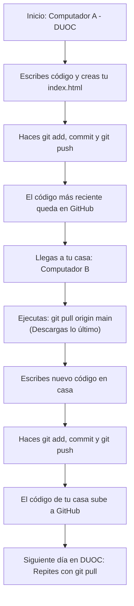

# Guía de Git y GitHub: El Flujo de Trabajo para Estudiantes

¡Hola! Git y GitHub son las herramientas más importantes en el desarrollo de software profesional. Nos permiten controlar el historial de cambios de nuestro código y colaborar con otros desarrolladores. 

Esta guía te enseñará el flujo de trabajo diario que debes seguir en tu portafolio y cómo coordinar tu código si trabajas en **dos computadoras diferentes** (por ejemplo, en los laboratorios de DUOC y en tu computadora personal en casa).

---

## 🎮 1. ¿Qué es Git? (La analogía del videojuego)

Para entender cómo funciona Git, imagínalo como el sistema de guardado de un videojuego de aventura:

*   **Tu Carpeta de Proyecto:** Es tu partida actual. Si cometes un error y el juego no se ha guardado, puedes perder todo tu avance.
*   **Git Commit (Punto de Guardado / Checkpoint):** Es cuando guardas la partida. Si escribes un código que destruye tu diseño, puedes "cargar la partida anterior" y volver al punto donde todo funcionaba perfectamente.
*   **GitHub (La Nube):** Es el servidor donde subes tus partidas guardadas. Si tu computadora falla, tus puntos de guardado siguen a salvo en la nube. También te permite descargar tus partidas en cualquier otra computadora para continuar jugando.

---

## 🚀 2. El Ciclo de Guardado Diario (El Flujo Básico)

Cada vez que completes una tarea (por ejemplo: centrar la tarjeta, agregar tu avatar, crear la hoja de estilos), debes guardar tus cambios utilizando esta secuencia de **4 comandos clave en la terminal**:

### 🔍 Paso 1: `git status` (Verificar cambios)
Antes de guardar, revisa qué archivos has modificado, creado o eliminado.
*   **Comando:** `git status`
*   **¿Qué verás?** Los archivos nuevos o modificados aparecerán en color **rojo**. Esto significa que Git sabe que cambiaron, pero aún no están preparados para el guardado.

### 📥 Paso 2: `git add .` (Preparar archivos)
Le dices a Git qué archivos quieres incluir en tu próximo punto de guardado. El punto (`.`) indica que quieres agregar **todos** los cambios de la carpeta actual.
*   **Comando:** `git add .`
*   **¿Qué pasa ahora?** Si ejecutas `git status` nuevamente, verás que los archivos cambiaron a color **verde**. Ya están listos para ser guardados.

### 📝 Paso 3: `git commit -m "mensaje"` (Crear punto de guardado)
Crea formalmente el checkpoint en tu computadora local. Debes incluir un mensaje descriptivo y corto de lo que hiciste entre comillas.
*   **Comando:** `git commit -m "Centra la tarjeta de presentacion con flexbox"`
*   > [!IMPORTANT]
    > **Usa mensajes descriptivos:** Evita usar mensajes vacíos como *"cambios"*, *"tarea"* o *"listo"*. Utiliza verbos de acción y sé descriptivo, por ejemplo: *"Agrega botones de redes sociales"* o *"Corrige rutas de imágenes"*.

### ☁️ Paso 4: `git push origin main` (Subir a GitHub)
Sube tus puntos de guardado locales a tu repositorio en GitHub para que queden respaldados en internet y se actualice tu sitio en GitHub Pages.
*   **Comando:** `git push origin main`

---

## 💻🔄💻 3. Sincronización: Trabajar en Dos Computadoras

Si trabajas en la universidad (Computador A) y en tu casa (Computador B), es común que te encuentres con problemas si no coordinas la sincronización de tu código.

Para evitar conflictos y pérdidas de trabajo, debes seguir una regla de oro estricta basada en el uso de **`git pull`**.

> [!WARNING]
> ### 🚨 La Regla de Oro de la Sincronización
> *   **Al llegar a trabajar:** Lo **primero** que debes hacer antes de tocar una sola línea de código es bajar el trabajo más reciente de GitHub.
> *   **Al terminar de trabajar:** Lo **último** que debes hacer antes de apagar o cerrar tu computadora es subir todo tu trabajo a GitHub.

### El Flujo de Trabajo Sincronizado paso a paso:



### 📥 ¿Cómo bajar los cambios con `git pull origin main`?
Cuando cambies de computadora, abre tu terminal en la carpeta del proyecto y ejecuta:

*   **Comando:** `git pull origin main`
*   **¿Qué hace?** Trae todos los puntos de guardado que subiste desde la otra computadora y los fusiona con tus archivos locales de forma automática. Ahora tu computadora está al día y puedes empezar a programar con seguridad.

> [!CAUTION]
> ### ¿Qué pasa si olvido hacer `git pull`?
> Si empiezas a escribir código en casa sin haber bajado primero lo que hiciste en la universidad, cuando intentes subir tus cambios GitHub te dará un error de **Conflicto (Conflict)**. Esto sucede porque GitHub no sabe cuál de las dos versiones del código es la correcta. Para evitar este dolor de cabeza, haz del `git pull` tu primer hábito al sentarte a codificar.

---

## 🗺️ 4. Resumen del Flujo de Datos

Aquí puedes observar de forma gráfica cómo se mueven tus archivos a través de las distintas áreas de Git hasta llegar a GitHub:

```text
 Mi Carpeta             Staging Area          Repo Local            GitHub
 (Workspace)           (Preparación)         (Computador)           (Nube)
    │                       │                    │                    │
 1. Modificas archivos      │                    │                    │
    ├──────────────────────>│                    │                    │
    │    git add .          │                    │                    │
    │                       │ 2. Guardas cambios │                    │
    │                       ├───────────────────>│                    │
    │                       │   git commit -m    │                    │
    │                       │                    │ 3. Subes cambios   │
    │                       │                    ├───────────────────>│
    │                       │                    │   git push         │
    │                       │                    │                    │
    │                       │  4. Bajas cambios  │                    │
    │                       │<────────────────────────────────────────┤
    │                       │    git pull        │                    │
```

---

## 📋 5. Tabla de Comandos Rápidos

Guarda esta tabla para consultarla rápidamente mientras trabajas en tus entregas formativas:

| Comando | 🛠️ ¿Para qué sirve? | 💡 Ejemplo |
| :--- | :--- | :--- |
| `git status` | Muestra el estado actual del repositorio y archivos modificados. | `git status` |
| `git add .` | Agrega todos los archivos modificados a la zona de preparación. | `git add .` |
| `git commit -m "mensaje"` | Guarda un punto de control local con un mensaje explicativo. | `git commit -m "Crea menu de navegacion"` |
| `git push origin main` | Envía todos los commits locales a la rama principal en GitHub. | `git push origin main` |
| `git pull origin main` | Trae y fusiona los últimos cambios de GitHub a tu computador. | `git pull origin main` |
| `git log --oneline` | Muestra tu historial de commits resumido en una sola línea. | `git log --oneline` |
