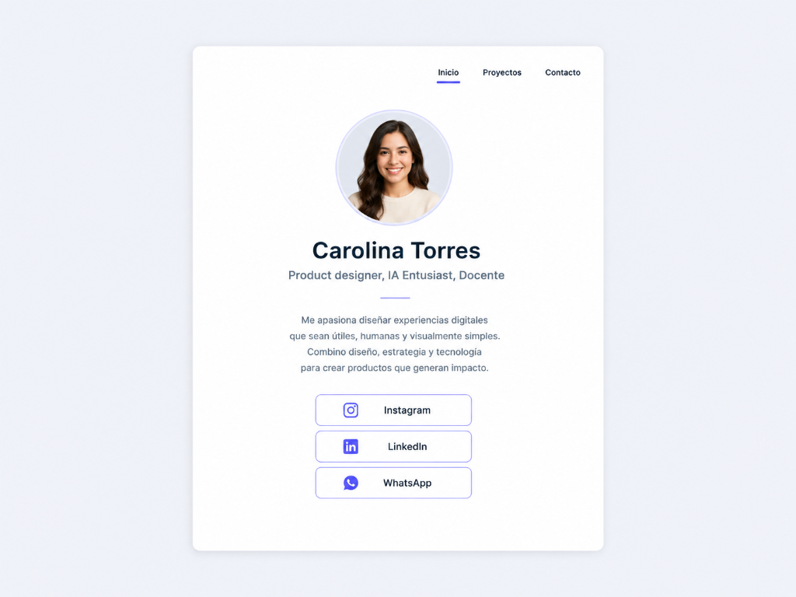

# Guía de Aprendizaje: Formativa 01 — Tarjeta de Presentación Personal

¡Hola! En esta guía aprenderás cómo preparar la base de tu primer sitio web personal. Tu objetivo para esta entrega es crear una **tarjeta de presentación (card)** que esté perfectamente centrada en la pantalla, sea totalmente responsiva (que se adapte tanto a computadores como a celulares) y contenga tu perfil básico.

---

## 📸 Diseño de Referencia
El resultado final que debes construir debe estructurarse de manera similar a este diseño de referencia:



> [!TIP]
> **Personalización Visual:** Los colores, fondos, fuentes tipográficas e íconos utilizados en este diseño son **meramente referenciales**. Eres completamente libre de elegir y proponer tu propia combinación de colores y tipografías para reflejar tu marca e identidad personal. Lo importante en esta entrega es respetar la estructura del contenido y la correcta distribución de sus elementos.

---

## 📁 1. Estructura de Carpetas del Proyecto

Para trabajar de forma limpia y ordenada, organiza los archivos de tu proyecto siguiendo esta estructura:

```text
mi-portafolio/
│
├── index.html          <-- Archivo principal HTML
│
├── css/
│   └── style.css       <-- Archivo para tus estilos CSS
│
└── img/
    └── avatar.jpg      <-- Tu fotografía, avatar o imagen de perfil
```

---

## 🏗️ 2. Estructura Base HTML (`index.html`)

El punto de partida de tu código HTML debe contener únicamente la declaración del documento, las vinculaciones de fuentes/estilos y el **contenedor principal vacío**. 

Tu primer desafío es empezar con esta estructura base e ir completando el contenido dentro del contenedor de la tarjeta:

```html
<!DOCTYPE html>
<html lang="es">
<head>
    <meta charset="UTF-8">
    <meta name="viewport" content="width=device-width, initial-scale=1.0">
    <title>Mi Portafolio - Tarjeta de Presentación</title>
    <!-- Vinculación del archivo CSS externo -->
    <link rel="stylesheet" href="css/style.css">
    <!-- Opcional: Tipografía desde Google Fonts (Outfit) -->
    <link rel="preconnect" href="https://fonts.googleapis.com">
    <link rel="preconnect" href="https://fonts.gstatic.com" crossorigin>
    <link href="https://fonts.googleapis.com/css2?family=Outfit:wght@300;400;600;700&display=swap" rel="stylesheet">
</head>
<body>

    <!-- CONTENEDOR CENTRAL (TARJETA) -->
    <main class="card">
        
        <!-- 
          TU DESAFÍO: Escribir todo el contenido aquí adentro.
          Debes incorporar:
          - Menú de navegación (Inicio, Proyectos, Contacto)
          - Tu imagen/avatar
          - Nombre y descripción profesional
          - Línea decorativa
          - Párrafo de biografía
          - Enlaces a tus redes sociales (mínimo 2)
        -->

    </main>

</body>
</html>
```

---

## 🎯 3. El Reto del Centrado Responsivo (`css/style.css`)

Centrar un elemento vertical y horizontalmente en la pantalla solía ser una tarea compleja en el diseño web. Hoy en día, la técnica estándar y más eficiente es usar **Flexbox** en el contenedor padre (en este caso, la etiqueta `<body>`).

Además, para que tu sitio sea **responsivo** (que se adapte bien tanto en pantallas de escritorio como en celulares sin desbordarse), utilizaremos un sistema de ancho fluido mediante porcentajes y límites de píxeles (`width` + `max-width`).

Crea tu archivo `css/style.css` y escribe la siguiente base de estilos:

```css
/* ==========================================================================
   1. RESET Y ESTILOS GENERALES
   ========================================================================== */
* {
    margin: 0;
    padding: 0;
    box-sizing: border-box; /* Permite calcular bordes y paddings dentro del tamaño del elemento */
}

body {
    font-family: 'Outfit', 'Arial', sans-serif;
    background-color: #f0f4f8; /* Color de fondo de la página */
    
    /* ESTRUCTURA DE CENTRADO (FLEXBOX) */
    display: flex;
    justify-content: center; /* Centra la tarjeta horizontalmente */
    align-items: center;     /* Centra la tarjeta verticalmente */
    
    min-height: 100vh;       /* Fuerza al body a ocupar todo el alto de la pantalla visible */
    padding: 20px;           /* Colchón de seguridad para que la tarjeta no choque en celulares */
}

/* ==========================================================================
   2. CONTENEDOR CENTRAL RESPONSIVO (CARD)
   ========================================================================== */
.card {
    background-color: #ffffff;
    
    /* RESPONSIVIDAD */
    width: 90%;             /* Ocupará el 90% de la pantalla en dispositivos móviles */
    max-width: 600px;       /* En pantallas grandes, se detendrá y no medirá más de 600px */
    
    border-radius: 16px;
    box-shadow: 0 10px 30px rgba(0, 0, 0, 0.05); /* Sombra suave para dar profundidad */
    padding: 40px;
    text-align: center;      /* Centra los textos que pongas dentro por defecto */
}
```

---

## 🛠️ 4. Guía de Desafíos: ¿Cómo completar tu tarjeta?

Ahora que tienes tu contenedor centrado y responsivo, debes usar tu creatividad y conocimiento de HTML/CSS para construir el contenido basándote en la referencia. 

Aquí tienes algunas sugerencias técnicas para lograrlo:

### 4.1 Menú de Navegación Superior
* **Estructura HTML:** Utiliza las etiquetas `<nav>`, `<ul>`, `<li>` y `<a>`.
* **Idea CSS:** Usa `display: flex` y `justify-content: flex-end` en la lista para alinear las opciones a la derecha de la tarjeta, y quita los puntos de la lista con `list-style: none`. Define una clase `.active` para el enlace de "Inicio" con un borde inferior decorativo (`border-bottom`).

### 4.2 El Avatar Circular
* **Estructura HTML:** Coloca tu imagen dentro de un contenedor `div`. No olvides añadir el atributo descriptivo `alt` en la etiqueta `img` (por accesibilidad).
* **Idea CSS:** Para que la foto no se deforme, dale al contenedor un tamaño fijo cuadrado (por ejemplo, `width: 150px; height: 150px;`) y centra este contenedor con `margin: 0 auto`. Aplica `border-radius: 50%` tanto al contenedor como a la imagen para hacerlos circulares, y usa `object-fit: cover` en la imagen.

### 4.3 Jerarquía de Textos y Línea Separadora
* **Estructura HTML:** Usa un `<h1>` para tu nombre, un `<p>` para tus especialidades, y la etiqueta `<hr>` para la línea divisoria.
* **Idea CSS:** Define diferentes tamaños de letra (`font-size`) y grosores (`font-weight`). Dale a la línea `<hr>` un ancho pequeño (por ejemplo, `width: 60px`) y céntrala con `margin: 0 auto`.

### 4.4 Botones de Enlace (Redes Sociales)
* **Estructura HTML:** Mínimo 2 enlaces (`<a>`). Puedes utilizar emojis o iconos vectoriales SVG para darles un toque profesional como el de la referencia.
* **Idea CSS:** Para que parezcan botones, dales estilos en CSS usando `display: flex`, agregando `padding`, bordes de color y `border-radius`. No olvides agregar el estado hover (`a:hover`) para cambiar el color de fondo o de texto cuando pases el mouse.

---

## 📚 5. Tutoriales y Recursos de Apoyo Recomendados

Para complementar tu aprendizaje de HTML, CSS y Flexbox, te recomendamos consultar y practicar con los siguientes recursos gratuitos en español:

### 🌐 Fundamentos de HTML y CSS
*   **[W3Schools - Tutoriales de HTML y CSS](https://www.w3schools.com/html/):** Una de las plataformas de aprendizaje más fáciles, intuitivas y populares del mundo. Cuenta con un editor interactivo para probar tu código en vivo (puedes traducir la página usando el selector de idioma en la esquina superior derecha).
*   **[MDN Web Docs - Aprende desarrollo web](https://developer.mozilla.org/es/docs/Learn):** La referencia oficial y definitiva de la web. Te sugerimos revisar sus guías didácticas sobre [Estructurar la web con HTML](https://developer.mozilla.org/es/docs/Learn/HTML) y de [CSS básico](https://developer.mozilla.org/es/docs/Learn/CSS).
*   **[freeCodeCamp - Certificación de Diseño Web](https://www.freecodecamp.org/espanol/):** Plataforma interactiva 100% gratuita. Su curso de **Diseño Web Adaptable** te enseña de forma práctica escribiendo código directamente desde el navegador.

### 🧩 Guías y Juegos para Dominar Flexbox (Alineación)
*   **[Flexbox Froggy - Aprende jugando](https://flexboxfroggy.com/#es):** Un divertido juego interactivo en el que guías a ranas escribiendo código Flexbox. Es la manera más didáctica de memorizar propiedades como `justify-content` y `align-items`.
*   **[MDN Web Docs - Conceptos básicos de Flexbox](https://developer.mozilla.org/es/docs/Web/CSS/CSS_flexible_box_layout/Basic_concepts_of_flexbox):** Artículo técnico de MDN para comprender a fondo los ejes principal y secundario.
*   **[Diego Amorin - Guía Ilustrada de Flexbox CSS](https://www.diegoamorin.com/flexbox/):** Un recurso gráfico en español muy cómodo para consultar visualmente qué hace cada propiedad de Flexbox.

---

## 🚀 6. Checklist de Verificación y Entrega

Antes de realizar tus commits y enviar tu tarea, comprueba los siguientes puntos:

- [ ] **Estructura HTML:** El archivo base `index.html` está en la raíz de tu proyecto.
- [ ] **Carpeta de Imágenes:** Tu avatar o imagen de perfil está dentro de la carpeta `img/`.
- [ ] **Estilos Vinculados:** Los estilos CSS se cargan correctamente desde la carpeta `css/`.
- [ ] **Centrado Perfecto:** Al redimensionar la ventana del navegador o abrir el inspector móvil, la tarjeta se mantiene en el centro de la pantalla.
- [ ] **Diseño Responsivo:** En celulares la tarjeta reduce su tamaño sin salirse de los bordes ni generar scroll horizontal.
- [ ] **Interactividad CSS:** Al pasar el cursor sobre los enlaces o botones, se visualiza un cambio de estado claro (hover).
- [ ] **Control de Versiones:** Realizaste al menos 3 commits descriptivos en Git y subiste el código a tu repositorio en GitHub (se evaluará el último commit antes del plazo de entrega).
- [ ] **Despliegue:** El sitio web está publicado en GitHub Pages y funciona correctamente (se evaluará el último deployment realizado a la fecha de entrega).
- [ ] **Configuración en GitHub:** Activaste la opción **"Deployments"** en la configuración de **"About"** en tu repositorio de GitHub (haciendo clic en el engranaje ⚙️ junto a *About* -> marca la casilla *Deployments* -> *Save changes*) para permitir la revisión del historial de publicación.
